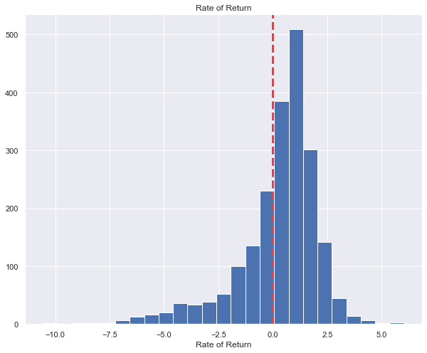
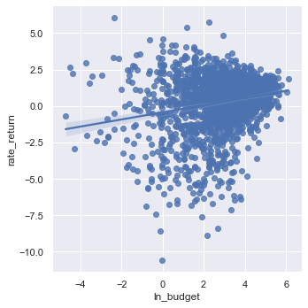
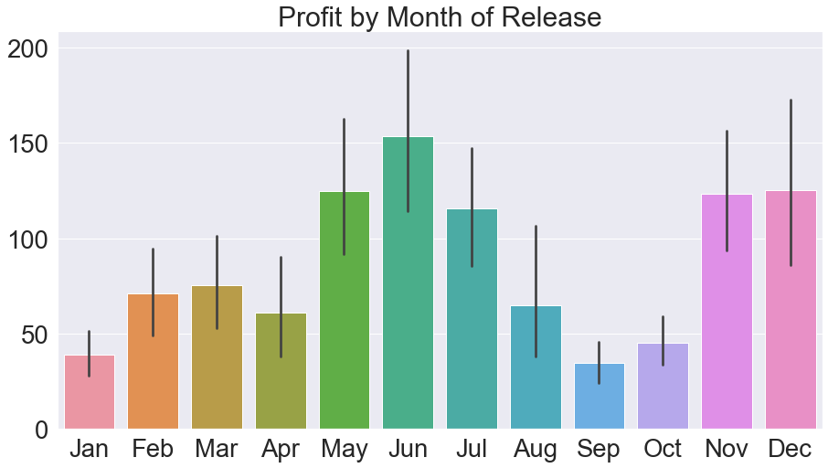
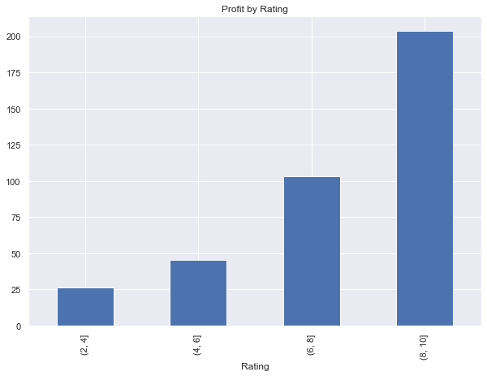

# Movie-Analysis-Mod1
By: Jagandeep Singh & Eryk Wdowiak

## Introduction
For this project we explored the movie Industry. We had data for over 2000+
movies. This data title, included budget, domestic_gross, worldwide_gross, rating,
crew, genres etc. But all these values were in different datasets. For analysis
and visualization, we used Pandas, numpy, Matplotlib and seaborn.

## Project Goals
Our goal in this project is to answer the following questions using the data
provided.
1. An Overview of Movie profitability\
2. What is the relationship between:\
     -a Movie’s Production Budget and its Profitability\
     -the Month of Release and Profitability\
     -Genres and Profitability\
     -Ratings and Profitability

## Data Cleaning
After loading all the data files, our first step was to clean the data.
Since the data was lay out over multiple files, our first task was to merge the
useful data in one pandas dataframe. We went through all of the given data files
to clean the data and merge it appropriately. Our goal in data cleaning was to
get everything we need in one place to make it easy for our exploratory data
analysis.

## Data Analysis and Visualization
Our first goal was an overview of movie profitability. We looked at the log of
production budget and worldwide_gross, then we calculated log of profit for each
movie. Then a histogram was plotted for log of profit. Then we looked at if
movie's production budget is related to profitability. Similarly we looked at
how was profitability related to month of release, genres and ratings of those
movies.

\
Histogram for rate of return.

\
Scatter plot of rate of return and ln budget

\
Average profit of movies by Release month

\
Percentage of genres in Most and Least profitable movies

\
Bar plot of ratings and profit of movies

## Conclusion
### Recommendations
Based on our analysis on rate of return, most movie investments are very profitable.\
Larger movie budgets are associated with high rate of return.\
We found that movies released in June and December are more profitable.\
In terms of genres, Action, Adventure and Sci-Fi movies are most profitable whereas\
Drama and comedy movies are least profitable.\
We also found that highest rated movies are more profitable than low rated movies.

### Here is the link to our presentation:
[Movie-Analysis-Presentation](https://docs.google.com/presentation/d/1GM80jBA_ng6gltuki6KBqi6Y7497tEwvciLKp3pmSAg/edit?usp=sharing)
